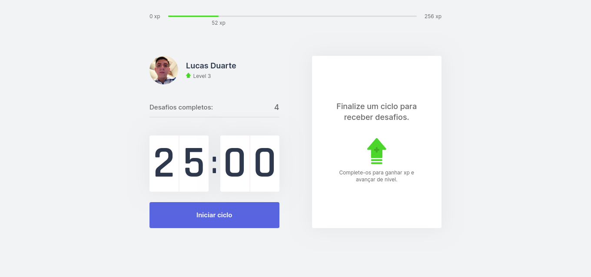
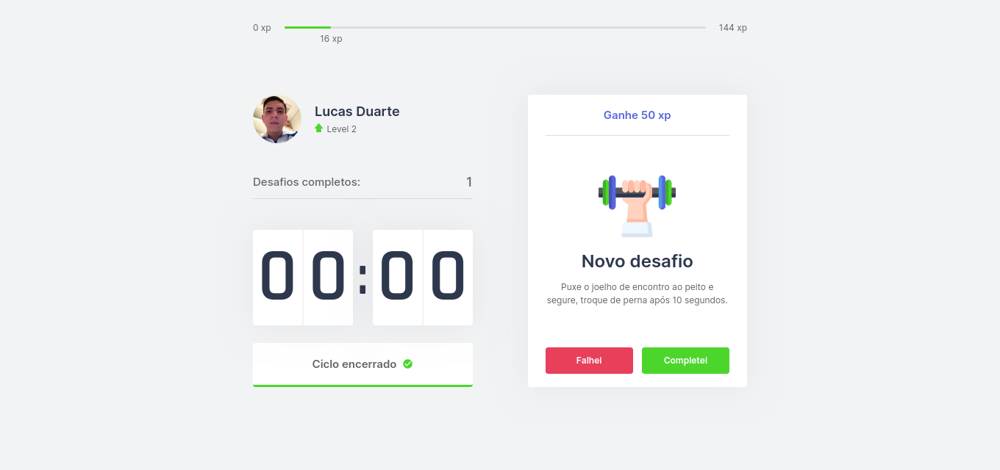
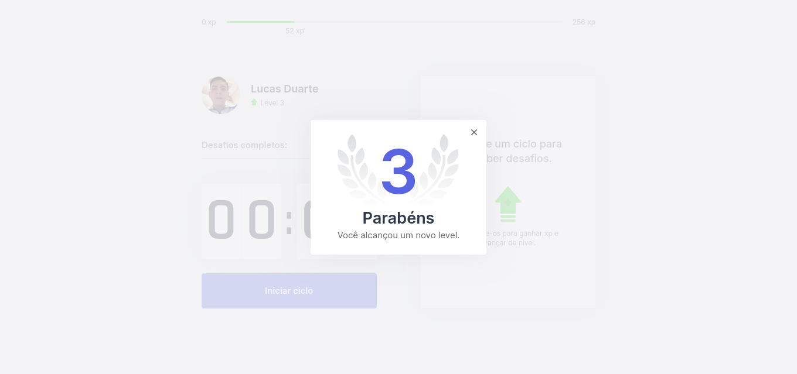
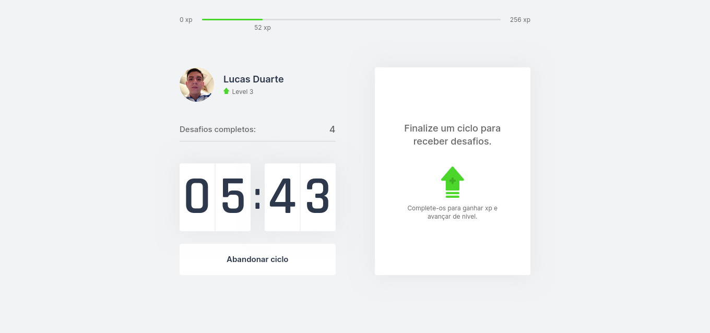

<h1 align="center">
  
</h1>

<h1 align="center">

</h1>

 
 

O Moveit é um projeto feito no NLW4 da Rockeseat, seguindo a trilha de React. O projeto une a técnica Pomodoro com a realização de pequenos exercicos fisicos para quem fica muito tempo a frente do computador, a cada ciclo bem sucedido o usuário ganha xp para subir de nivel.

 
 

## 💻 Tecnologias

Esse projeto foi desenvolvido com as seguintes tecnologias:

- [React](https://reactjs.org)
- [Next.js](https://nextjs.org/)
- [TypeScript](https://www.typescriptlang.org/)

 
 

## 🚀 Como executar

É necessario ter o Nodejs com no minimo a versão 12.

- Clone o repositório
- Instale as dependências com `npm install`
- Inicie o servidor com `npm run dev`

Agora você pode acessar [`localhost:3000`](http://localhost:3000) do seu navegador.

 
 

## 📄 Licença

Esse projeto está sob a licença MIT. Veja o arquivo [LICENSE](LICENSE.md) para mais detalhes.

---

Feito com ♥ por Lucas Duarte 👋🏻 